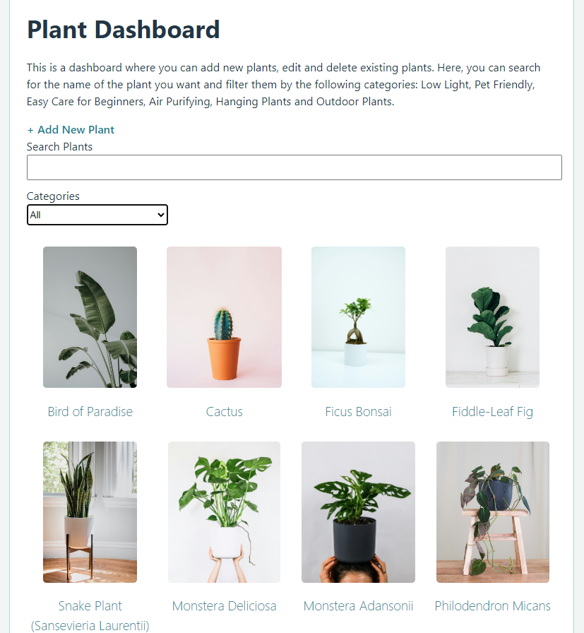
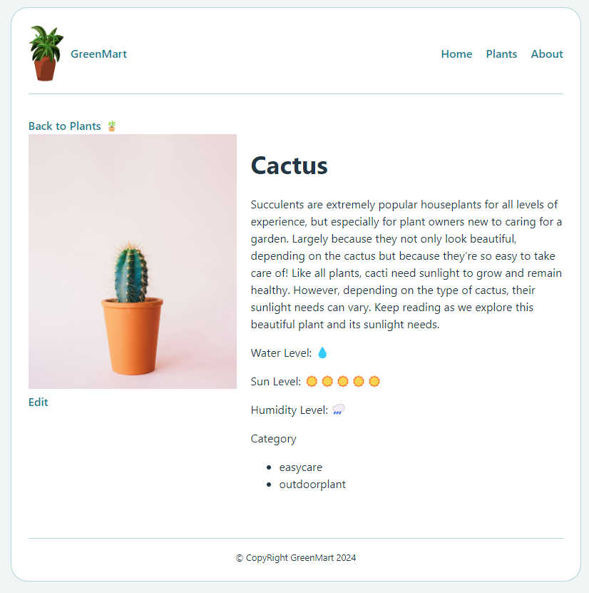
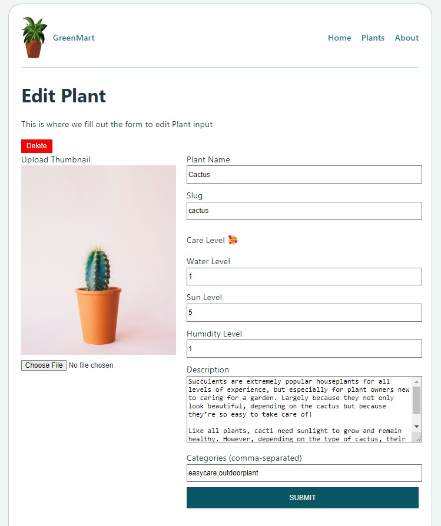

# GreenMart 🪴
A full-stack MERN project with a simple CRUD operation for a plant application.

## Technologies:
* NodeJS
* MongoDB (Mongoose)
* Express 
* React

## Features:
* Create new plant
* Update existing plant
* Delete a plant
* Search for a search
* Sort plant names alphabetically
* Filter plant according to categories
* Upload thumbnail image
* Store data on MongoDB

